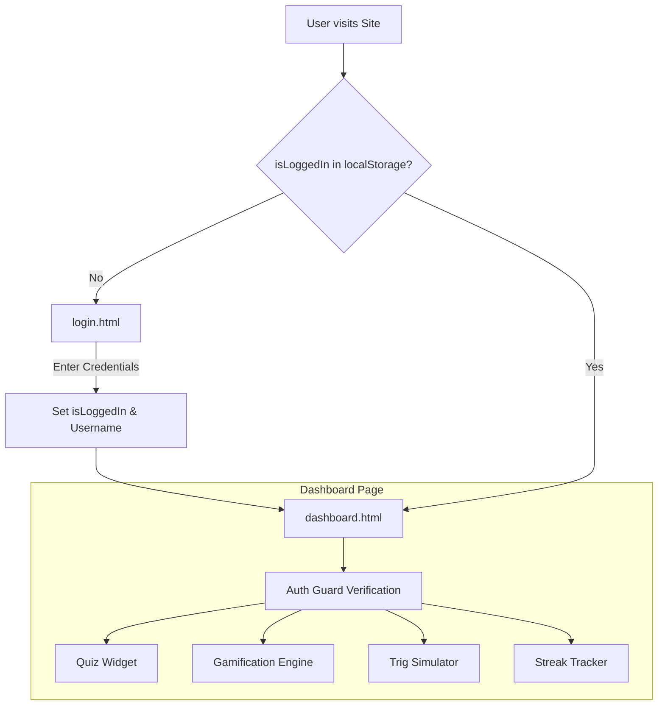

# 🧮 Math-to-Story 📖

**Math-to-Story** is an interactive web application designed to help users learn mathematical concepts through real-world scenarios and engaging stories. Instead of abstract formulas, concepts like Trigonometry, Probability, and Quadratic Equations are explained with practical applications!

---

## 🚀 Live Demo

- **Frontend (Netlify):** [https://math-to-story.netlify.app](https://math-to-story.netlify.app)
- **Backend (Render):** [https://math-to-story.onrender.com](https://math-to-story.onrender.com)
## 🔗 Live Application Links

* 🔑 **Login Page (Start Here):** [https://math-to-story.onrender.com/login.html](https://math-to-story.onrender.com/login.html)
* 📊 **Dashboard (Guarded):** [https://math-to-story.onrender.com/dashboard.html](https://math-to-story.onrender.com/dashboard.html)
* 🏠 **Home Page:** [https://math-to-story.onrender.com](https://math-to-story.onrender.com)

---

## 🔄 User Navigation Flow

1. **Authentication (`login.html`):** Users enter their email and password to log in. Session flag is set in `localStorage`.
2. **Home Page (`index.html`):** Explore concepts (Geometry, Statistics, Algebra) with direct navigation to Login/Dashboard.
3. **Guarded Dashboard (`dashboard.html`):** 
   - *Security Check:* Redirects unauthenticated users back to `login.html`.
   - *Interactive Widgets:*
     1. 🧠 **Daily Math Quiz Widget**
     2. 🎮 **Gamification Widget (XP & Levels)**
     3. 📐 **Trigonometry Interactive Simulator**
     4. 🔥 **Active Streak & Badges**

---

## ✨ Features

- 🎯 **Interactive Learning:** Explore math topics through real-world scenarios.
- 📐 **Multiple Topics:** Covers Geometry (Trigonometry), Statistics (Probability), Algebra (Quadratic Equations), and more.
- ⚡ **Full-Stack Architecture:** Connected frontend and backend via REST API.
- 📱 **Responsive Design:** Clean and accessible UI across desktop and mobile devices.

---

## 🛠️ Tech Stack

- **Frontend:** HTML5, CSS3, JavaScript (ES6)
- **Backend:** Node.js, Express.js
* **State Management:** Browser `localStorage`
* **Hosting:** Render & Netlify
- **Deployment:** Netlify (Frontend), Render (Backend)
- **Version Control:** Git & GitHub

---

## 💻 Local Development Setup

To run this project locally on your machine, follow these steps:

1. **Clone the repository:**
   ```bash
   git clone [https://github.com/Mymuna-324/math-to-story.git](https://github.com/Mymuna-324/math-to-story.git)
   cd math-to-story
   ```
## 🏗️ Project Architecture
+-------------------------------------------------------------------+
|                        Client Browser                             |
+-------------------------------------------------------------------+
|                                          |
v                                          v
[ index.html ]                           [ login.html ]
(Landing Page)                           (Authentication)
|                                          |
| Navigates to                             | Saves Session &
v                                          | Username
[ dashboard.html ] <------------------------------+
(Protected Dashboard)  (localStorage Check: isLoggedIn === "true")
|
+---> 🧠 Daily Math Quiz Widget
+---> 🎮 Gamification Widget (XP & Level)
+---> 📐 Trigonometry Simulator
+---> 🔥 Active Streak & Badges


### ⚙️ Component Flow:
1. **Landing & Discovery (`index.html`):** Public entry point introducing concepts.
2. **Auth Layer (`login.html`):** Validates input, derives display username, sets `localStorage.setItem("isLoggedIn", "true")`.
3. **Auth Guard & State Check (`dashboard.html`):** Instant script check in `<head>`. Redirects to `login.html` if unauthenticated.
4. **Interactive Dashboard Core:** Initializes 4 client-side widgets using vanilla JavaScript DOM events and reactive state updating.


Markdown
## 🏗️ System Architecture


